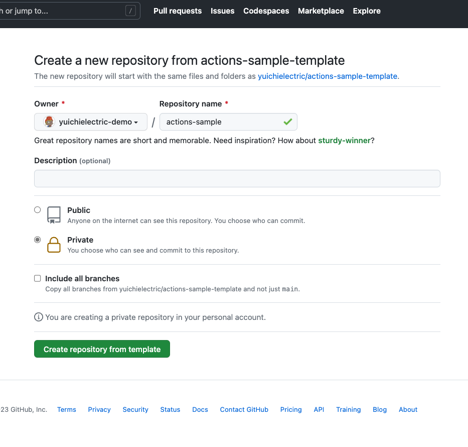

# GitHub Actions入門

このリポジトリでは、GitHub Actionsを初めて触る方向けに、実際に簡単なGitHub Actionsワークフローをセットアップする手順を紹介します。

## このハンズオンを通して学べること

 - GitHub Actionsを有効化する手順
 - Java、Mavenを使ったコードベースに対して自動ビルド、自動テスト、リンターをセットアップする方法

## 事前準備

1. まず下図のように、このテンプレートリポジトリからリポジトリの作成を選択します。


2. 作成するリポジトリの情報を入力します。
  - ここで、"Owner"はどこにリポジトリを作成するかを選択します。今回は自分のアカウント名を選択します（つまり、個人リポジトリを作ることになります）。
  - "Repository name"にはリポジトリの名前を指定します。名前は何でも構いませんが、今回は"actions-sample"という名前にします。
  - "Owner"を選択すると、画面下部に"Public"、"Private"という2つの選択肢が出ます。"Public"を選択すると、誰でも見れるリポジトリとなります。"Private"を選択すると、明示的に他の人にアクセスを許可する設定をしない限り自分以外は見れないリポジトリとなります。"Public"の場合、GitHub Actionsは無償で利用可能です。"Private"の場合は[実行時間に応じた料金が発生](https://docs.github.com/ja/billing/managing-billing-for-github-actions/about-billing-for-github-actions#per-minute-rates)しますが、毎月[無料枠](https://docs.github.com/ja/billing/managing-billing-for-github-actions/about-billing-for-github-actions#included-storage-and-minutes)が付与されているので、今回のハンズオンだけであれば無料枠の範囲内で収まります。どちらを選ぶかはお任せします。



3. リポジトリの作成が完了すると、作成されたリポジトリのトップページが表示されます。以後の作業は、この作成したリポジトリのページで行います。

## GitHub Actionsの有効化

1. リポジトリのページを開いたら、画面上部のメニューから"Actions"を選択します。


2. 下図のような"Get started with GitHub Actions"と書かれたページが表示されるはずです。この画面は、GitHub Actionsを有効化するにあたって、様々なワークフローテンプレートを表示しています。"Suggested for this repository"と書かれた部分には、リポジトリの言語やフレームワークに応じたワークフローテンプレートが表示されます。今回はJava、Mavenを使ったコードベースに対して自動ビルド、自動テスト、リンターをセットアップするため、"Java with Maven"の"Configure"ボタンをクリックします。


3. すると、以下のような画面が表示されます。GitHub Actionsを有効化するというのは、この画面で表示されているようなYAMLファイルをリポジトリの`/.github/workflows/`ディレクトリの下に置くことを意味します。このディレクトリの下に置かれたYAMLファイルはGitHubが自動的にGitHub Actionsワークフローの定義ファイルであると認識をします。下図の赤枠で囲まれた部分には、テンプレートの内容が表示されています。今回は、最小限のビルドステップを実行するため、テンプレートファイルに表示されている内容のうち、33行目以降を削除してください。


4. 次に"Start commit"ボタンをクリックします（下図１枚目）。すると、このファイルをリポジトリにコミットするためのダイアログが表示されます（下図２枚目）。今回はこのまま"Commit changes"ボタンをクリックして、テンプレートファイルをリポジトリにコミットします。


5. テンプレートファイルをリポジトリにコミットすると、GitHub Actionsが有効化されます。"Actions"タブ（下図１枚目）をクリックすると、GitHub Actionsの実行履歴が表示されます（下図２枚目）。今回追加したGitHub Actionsのワークフローでは`main`ブランチへのpushをトリガーする設定となっており、すでに実行が開始（もしくは実行が完了）している状態になっています。


6. 実行が失敗しているようなので、何が原因で失敗しているかをみてみましょう。失敗した実行結果をクリックして、詳細画面を見てみます（下図）。`Process completed with exit code 1.`と書かれているので、ワークフロー内でのステップで返り値が1が返ってきたのが失敗した理由のようです。もう少し詳細にみてみるために、下図の赤枠で囲まれたところをクリックします。


7. すると、GitHub Actionsの実行ログが表示されます。その中でもエラーが発生している箇所が表示されます。このログの中の以下の部分から、`org.yuichielectric.AppTest`というテストクラス内の`testAdd`というメソッドでのテストが失敗していることがわかります。


```
[INFO] Running org.yuichielectric.AppTest
Error:  Tests run: 2, Failures: 1, Errors: 0, Skipped: 0, Time elapsed: 0.066 s <<< FAILURE! - in org.yuichielectric.AppTest
Error:  testAdd(org.yuichielectric.AppTest)  Time elapsed: 0.012 s  <<< FAILURE!
java.lang.AssertionError
	at org.yuichielectric.AppTest.testAdd(AppTest.java:24)

[INFO]
[INFO] Results:
[INFO]
Error:  Failures:
Error:    AppTest.testAdd:24
[INFO]
Error:  Tests run: 2, Failures: 1, Errors: 0, Skipped: 0
```

8. テストケースが失敗したことが判明したので、この失敗している箇所を修正し（ヒント：`src/test/java/org/yuichielectric/AppTest.java:24行目）、その変更をGitHubにpushすることで、再度GitHub Actionsのワークフローが開始され、自動ビルド・テストが実行されます。そこで、テストが成功するようになれば、GitHub Actionsのワークフローも成功します。

9. このワークフローを少しカスタムしてみましょう。ここまでの手順で作成したワークフローは`mvn package`を実行してビルドが通るかどうかを確認していました。せっかくパッケージまで作成しているので、その成果物であるアーカイブを使えるようにGitHub上に保存しましょう。これを実現するにはいくつかのやり方がありますが、今回は生成したアーカイブファイルをGitHub Actionsのワークフローの実行結果にアップロードする方法を試してみます。まず、そのための良い方法がないかをGitHub Marketplace上で探してみましょう。[GitHub MarketplaceのActionsカテゴリ](https://github.com/marketplace?type=actions)で"upload"と検索してみます。すると、下図のように"Upload a Build Artifact"というものが見つかりました。


10. "Upload a Build Artifact"の詳細画面を見てみると、使い方が書いてあります。`steps`に一つステップを追加するだけでこのアクションを使えそうです。今回は、`mvn package`で生成されたアーカイブファイルをアップロードしたいので、以下のようなステップを`maven.yml`の最後のステップとして追加してください（インデントが前のステップの定義と揃うように注意してください）。

```yaml
    - uses: actions/upload-artifact@v3
      with:
        name: Java App jar file
        path: ./target/*.jar
```

11. 上記の変更をpushすると、ワークフローがトリガーされます。実行が完了すると、実行結果画面に下図のようにjarファイルが保存されるようになっているはずです。このようにjarファイルを保存することができたので、例えば次のステップとしてこのjarファイルをテスト環境や動作確認環境にデプロイをするワークフローを追加することも可能になります。


## この先のステップ

今回のハンズオンでは、GitHub Actionsを有効化し、実行し、その結果を確認する最低限のステップのみを紹介しました。しかし、GitHub Actionsの強力さはこれだけではありません。以下にこの次のステップとして試してみると良いトピックをいくつか紹介します。ぜひ取り組んでみてください。

 - プルリクエスト上での自動ビルド・テストがどう実行されるかを確認する。今回追加したGitHub Actionsのワークフローはプルリクエスト上での自動ビルド・テストにも対応しています。実際に簡単にコードを変更してプルリクエストを作成することで、下図のようにプルリクエストの画面上でもGitHub Actionsの実行結果が一目でわかるようになっていることを確認してみましょう。


 - 他のワークフローを追加してみる。一つのリポジトリの中に、複数種類のGitHub Actionsのワークフローを追加することも可能です。単に`/.github/workflows/`ディレクトリにYAMLファイルを増やしていくだけで実現できます。他の種類のワークフローも追加してみましょう（ヒント：CheckstyleというJava用のリンターを実行するためのGitHub Actions定義ファイルを`/.github/checkstyle.yml`という名前で置いてあります。一番簡単なやり方はこのファイルを`/.github/workflows/`ディレクトリに移動するだけです）。

 - [GitHub MarketplaceのActionsカテゴリ](https://github.com/marketplace?category=&query=&type=actions&verification=)を眺めてみて、自分のプロジェクトに関係しそうなactionがないかどうかを探してみる。ぜひ、実際のactionを使ったワークフローを作成してみてください。

 - [GitHub Actionsのオンラインチュートリアル](https://learn.microsoft.com/ja-jp/training/paths/automate-workflow-github-actions/)を試してみる。このチュートリアルはMicrosoft Learn上に公開されており、このハンズオンよりもさらに発展的な内容を自らの手で試しながら学ぶことができます。

 - 今回追加したワークフローが失敗した場合にそのプルリクエストのマージを禁止する設定を有効化してみる。この設定は「ブランチ保護ルール」と呼ばれています。有効化の手順は[こちら](https://docs.github.com/ja/repositories/configuring-branches-and-merges-in-your-repository/managing-protected-branches/managing-a-branch-protection-rule#creating-a-branch-protection-rule)に記載されています。